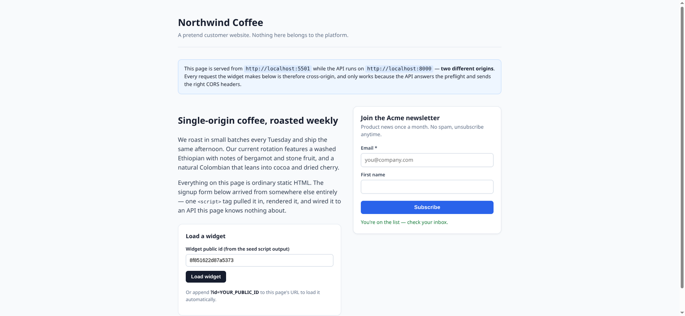

# Embeddable Widget & Lead-Capture Platform

FlyRank Internship · Backend Track · Capstone

A customer defines a widget in an authenticated API, pastes **one `<script>`
tag** onto any website, and the leads it captures arrive validated,
rate-limited, spam-filtered, geo-enriched, and queryable in a dashboard.

The submission endpoint is reachable by the entire public internet. Everything
in this repository follows from that: the client is never trusted, the traffic
is never predictable, and a broken dependency must degrade the response rather
than destroy it.

```
Widget Owner (authenticated)
    └─▶ Widget Management API ─▶ Widget DB (tenant-isolated) ─▶ embed snippet

Customer Website (any origin)
    <script src="{API}/embed/widget.v1.js?id=abc123">
        └─▶ GET /embed/widget.v1.js              public · immutable · 1 year
        └─▶ GET /api/public/widgets/:id/config   public · max-age=60 · ETag
                └─▶ render widget into the host page

Website Visitor
    └─▶ POST /api/public/submissions             public · CORS · preflighted
            │ payload validation ────────── bad payload?  → 4xx, never 500
            │ origin allow-list ─────────── wrong origin? → 403
            │ rate limit (per IP, per widget) ─ flood?    → 429, API stays up
            │ spam check (honeypot, fill-time) ─ bot?     → silently dropped
            │ geo enrichment:  provider A ─(fails)─▶ provider B ─(fails)─▶ store anyway
            │ store submission ─┐
            │ queue side effect ─┘ same transaction
            └─▶ 201  (a failing email/webhook can never reach this line)

    Outbox worker (background) ─▶ email / webhook
            retry with exponential backoff → dead-letter + ALERT log

Widget Owner (authenticated)
    └─▶ Dashboard API ◀── submissions + stats
```

The widget rendering on a page served from a *different origin* than the API:



*(The screenshot shows port 5501 because 5500 was taken on the machine it was
captured on — host ports are configurable, see below.)*

---

## Run it

Requires Docker. Nothing else, no credit card, no cloud account.

```bash
git clone <this-repo> && cd <this-repo>
cp .env.example .env          # sensible defaults; no editing needed
./scripts/preflight.sh        # checks the 4 host ports are free
docker compose up -d          # API + Postgres + Mailpit + the "customer site"
docker compose exec api python scripts/seed.py
```

That is the whole setup. `docker compose up` runs migrations before the server
starts, so the schema is always current.

**Run `preflight.sh` first.** Docker aborts the *entire* stack if any single
host port is taken — so a stray process on 5500 stops the API from starting, and
Docker's only explanation is `address already in use`. The preflight names each
conflict, says what is holding it, and prints the exact `sed` command to fix it.

| What | Where |
|---|---|
| API | http://localhost:8000 |
| Interactive API docs | http://localhost:8000/docs |
| "Customer website" (second origin) | http://localhost:5500/index.html |
| Mailpit (caught emails) | http://localhost:8025 |

The seed script prints two demo accounts and the embed snippets for their
widgets. Paste a widget's `public_id` into the customer site — or open
`http://localhost:5500/index.html?id=<public_id>` — and the widget renders,
loaded cross-origin from the API.

> **Ports already in use?** All four host ports are configurable in `.env`:
> `API_PORT`, `TESTSITE_PORT`, `POSTGRES_PORT`, `MAILPIT_UI_PORT`. VS Code's Live
> Server holds 5500 by default, which is a common collision. `./scripts/preflight.sh`
> detects this and prints the fix.

### Tests

```bash
docker compose exec -T db psql -U leadcapture -d postgres -c "CREATE DATABASE leadcapture_test;"
docker compose exec api pytest -q
```

### The six acceptance probes

```bash
./scripts/probes.sh
```

Runs every probe from Section 13 of the brief against the live stack and prints
a pass/fail transcript. It toggles the documented environment flags for the
fallback and side-effect probes and restores `.env` on exit. Captured output is
in [EVIDENCE.md](EVIDENCE.md).

---

## API

Full interactive documentation at `/docs`. Summary:

### Owner — authenticated with `Authorization: Bearer <jwt>`

| Method | Path | |
|---|---|---|
| `POST` | `/api/auth/register` | create a tenant, returns a JWT |
| `POST` | `/api/auth/login` | returns a JWT |
| `GET` | `/api/auth/me` | current tenant |
| `POST` | `/api/widgets` | create a widget |
| `GET` | `/api/widgets` | list this tenant's widgets |
| `GET` | `/api/widgets/{id}` | one widget |
| `PATCH` | `/api/widgets/{id}` | partial update, bumps `config_version` |
| `DELETE` | `/api/widgets/{id}` | delete |
| `GET` | `/api/widgets/{id}/embed` | the embed snippet and URLs |
| `GET` | `/api/dashboard/summary` | totals, enrichment rate, spam blocked |
| `GET` | `/api/dashboard/submissions` | paginated leads (`widget_id`, `limit`, `offset`) |
| `GET` | `/api/dashboard/widgets/{id}/stats` | counts by day and by country |

Every one of these is scoped to the caller's tenant in the SQL itself.
Requesting another tenant's widget returns `404`, not `403` — the API never
confirms that someone else's id exists.

### Public — any origin

| Method | Path | |
|---|---|---|
| `GET` | `/embed/widget.{version}.js` | versioned bundle, `max-age=31536000, immutable`, ETag |
| `GET` | `/api/public/widgets/{public_id}/config` | small payload, `max-age=60`, ETag `"{id}-v{version}"` |
| `POST` | `/api/public/submissions` | the hardened submission endpoint |
| `OPTIONS` | `/api/public/submissions` | preflight |
| `GET` | `/healthz`, `/readyz` | liveness, readiness |

Submission request:

```json
{
  "widget_id": "8f851622d87a5373",
  "data": { "email": "visitor@example.com", "first_name": "Vee" },
  "honeypot": "",
  "elapsed_ms": 8400
}
```

Optional `Idempotency-Key` header: a replay returns the originally stored row
instead of creating a second lead.

Responses: `201` stored · `403` origin not allowed · `404` unknown or inactive
widget · `413` body too large · `422` validation failed · `429` rate limited.
Errors are always `{"error": "...", "detail": ...}`.

---

## How the hard parts work

### CORS

Customer sites are arbitrary origins we cannot know in advance, so the public
surface allows any origin. Credentials are deliberately **off**: authentication
is a Bearer token and never a cookie, so `allow_origins=["*"]` gives a hostile
page nothing to ride on. Owners who want a narrower rule set
`allowed_origins` per widget, enforced server-side in the route handler — the
browser's CORS headers are a convenience, the allow-list is the control.

### Caching

The bundle URL carries its version (`widget.v1.js`), so it is immutable and
cached for a year; shipping a new bundle means a new URL, never a stale cache.
The config is short-lived with an ETag derived from `config_version`, which
`PATCH` increments — so an edited widget invalidates immediately while an
unchanged one answers `304`.

### Rate limiting

Two sliding windows: per IP (stops one flooder) and per widget (stops a
distributed flood burying one customer). Over the limit gets `429` with
`Retry-After`; a legitimate request from another IP during a flood still
succeeds, and the rest of the API keeps serving.

### Spam

A honeypot field the widget renders off-screen with `aria-hidden` and
`tabindex="-1"`, plus a fill-time heuristic. A blocked submission receives the
**same success response a real one gets** — the bot learns nothing — while
nothing is stored and a `spam_events` row feeds the dashboard's counter.

### Enrichment that degrades

`enrich_ip` walks a provider chain and catches everything, including a provider
raising something unplanned. It has no failure mode that reaches the caller: A
fails → B answers; both fail → `("unavailable", None)` and the lead is stored
without geo. Providers know nothing about each other; the chain owns the policy.

Live mode uses ip-api.com then ipapi.co. `GEO_MODE=mock` uses two deterministic
mock providers toggled by `GEO_MOCK_A_UP` / `GEO_MOCK_B_UP`, which is how the
fallback is proven repeatably.

### Side effects that cannot break a submission

The request path never sends an email or calls a webhook. It writes an
`outbox_events` row in the **same transaction** as the submission — if the lead
is stored the effect is queued, if it is not, nothing is queued. A background
worker claims events with `SELECT ... FOR UPDATE SKIP LOCKED`, retries with
exponential backoff, and after `OUTBOX_MAX_ATTEMPTS` marks the event `failed`
and logs an `ALERT` line. Set `SIDE_EFFECT_FORCE_FAIL=true` to watch a
submission succeed while its side effect fails forever.

### Idempotency

Two layers. A client's `Idempotency-Key` is enforced by a unique constraint on
`(widget_id, idempotency_key)`, so a concurrent replay loses at the database
rather than in application logic. And `SKIP LOCKED` means one outbox event is
claimed by exactly one worker, so the confirmation email is sent once.

---

## Layout

```
app/
  main.py            middleware, routers, worker lifespan
  config.py          settings, entirely from the environment
  db.py  models.py   engine, session, SQLAlchemy models
  schemas.py         Pydantic — validation at the boundary
  security.py        bcrypt + JWT
  errors.py          one JSON error shape for the whole API
  deps.py            auth and client-IP dependencies
  ratelimit.py       sliding-window limiter
  spam.py            honeypot + fill-time heuristic
  enrichment/        providers.py (independent) + chain.py (policy)
  outbox/            worker.py (retries, backoff, dead-letter) + handlers.py
  routers/           HTTP layer only
  services/          business logic, tenant scoping, transactions
  static/widget.js   the embeddable bundle
migrations/          Alembic
scripts/             preflight.sh, seed.py, probes.sh
testsite/            the "customer website" on a second origin
tests/               79 tests
docs/design.md       the one-page design document
```

---

## Limitations — honest notes

- **Rate limiting is per-process and in-memory.** Correct for this deployment;
  running several API replicas would multiply the effective limit. The storage
  sits behind `SlidingWindowLimiter`, so Redis is a drop-in swap.
- **`X-Forwarded-For` is trusted when present.** Fine behind a proxy we control,
  wrong on a public deployment without validating the proxy chain — a client can
  otherwise spoof its IP past the per-IP limit. The per-widget bucket still
  holds.
- **The outbox worker runs in the API process.** Adequate here, and it is
  already safe to run several (`SKIP LOCKED`), but production would run it as a
  separate deployable so request load and job load scale apart.
- **No email deliverability.** Mailpit catches mail locally. What is engineered
  here is that a failure cannot break a submission, not that mail arrives.
- **Geo is IP-level.** City accuracy from a free provider is approximate, and
  VPN traffic is simply wrong. Treated as a nice-to-have, which is why the
  system is built to lose it without noticing.
- **No submission export or retention policy.** Leads accumulate forever; GDPR
  export/delete is a listed stretch goal, not built.
- **The dashboard is JSON only.** A deliberate non-goal — this is a backend
  capstone.

---

## Configuration

Every setting is an environment variable; see [.env.example](.env.example) for
the complete list with safe placeholders. Nothing secret is committed — `.env`
is git-ignored and there are no credentials anywhere in the history.

The flags that matter for demonstrating behaviour:

| Variable | Effect |
|---|---|
| `GEO_MODE` | `mock` (deterministic) or `live` (ip-api.com, ipapi.co) |
| `GEO_MOCK_A_UP` / `GEO_MOCK_B_UP` | toggle a mock provider "down" |
| `SIDE_EFFECT_FORCE_FAIL` | make every side effect throw |
| `RATE_LIMIT_IP_PER_MINUTE` | per-IP submission budget |
| `MAX_BODY_BYTES` | body size above which requests get `413` |
| `HONEYPOT_FIELD` | the hidden field name the widget renders |

## License

MIT — see [LICENSE](LICENSE).
